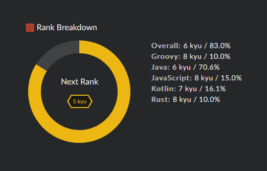

# Примеры решений задач с codewars.com

[Профиль на сайте](https://www.codewars.com/users/Jacen)  



```kotlin
fun argsCount(vararg args: Any): Int {
    return args.size
} 
```

```java
class Kata {
    static String noSpace(final String x) {
        return x.replaceAll(" ", "");
    }
}
```
```Rust
fn no_space(x : String) -> String{
  x.replace(" ","")
}
```

```Kotlin
object FileNameExtractor {
  fun extractFileName(dirtyFileName:String):String {   
   return """_((\w+)(\-\w+.\w+)|(\w+)\.\w+)""".toRegex().find(dirtyFileName)!!.groups!!.get(1)!!.value
  }
}
```

```Java
public class CharProblem {
  public static int howOld(final String herOld) {

   return Integer.valueOf(herOld.substring(0, 1));
  
  }
}
```

```Java
public class XO {
  
  public static boolean getXO (String str) {
    return str.toLowerCase().replaceAll("[^o]", "").length() == str.toLowerCase().replaceAll("[^x]", "").length() ? true : false;
  }
}
```

```Java
import java.util.Arrays;
import java.util.Collections;

public class DescendingOrder {
  public static int sortDesc(final int num) {
       int[] ints = Integer.toString(num).chars().map(c -> c - '0').toArray();

        Integer[] integers = Arrays.stream(ints).boxed().toArray(Integer[]::new);
        Arrays.sort(integers, Collections.reverseOrder());

        StringBuilder sb = new StringBuilder();

        for (Integer e : integers) {
            sb.append(e);
        }
        
        return Integer.valueOf(sb.toString());
  }
}
```

```Java
import java.util.Arrays;
public class MorseCodeDecoder {
    public static String decode(String morseCode) {        
        String[] words = morseCode.trim().split("   ");
        StringBuilder sb = new StringBuilder();     
        for (String word : words) {
            for (String letter : word.split(" ")) {
                sb.append(MorseCode.get(letter));
            }
             sb.append(" ");
        }
        return sb.toString().trim();
    }
}
```

```Java
public class Kata {

  public static String solution(String str) {
    return new StringBuilder(str).reverse().toString();
  }
}
```

```Kotlin
fun nbYear(pp0: Int, percent: Double, aug: Int, p: Int): Int {
        var k = 0
        var pp1: Int = pp0;
        while (pp1 < p) {
            k++
            pp1 += (pp1 * percent / 100 + aug).toInt()
        }
        return k;
}
```

```Java
class Arge {
    
    public static int nbYear(int p0, double percent, int aug, int p) {
       
       int k = 0;
       while (p0<p){
         k++;
         p0 += p0 * percent / 100 + aug;
       }
       return k;       
    }
}
```


```Java
public class Accumul {

    public static String accum(String s) {
        StringBuilder sb = new StringBuilder();
        sb.append(s.toCharArray()[0]);
        
        for(int i =1; i< s.toCharArray().length; i++){
            sb.append("-");
            Character letter = s.toCharArray()[i];
            sb.append(Character.toUpperCase(letter));
            for(int j =0; j < i; j++){
                sb.append(Character.toLowerCase(letter));
            }
        }
        return sb.toString();
    }
}
```


```Java
class Kata {
  public static String getMiddle(String word) {
    if(word.length()%2==0){           
            return word.substring(word.length()/2-1,word.length()/2+1);
        } else return word.substring(word.length()/2,word.length()/2+1);
  }
}
```


```Kotlin
fun getMiddle(word: String): String {
        return if (word.length % 2 == 0) {
            word.substring(word.length / 2 - 1, word.length / 2 + 1)
        } else {
            word.substring(word.length / 2, word.length / 2 + 1)
        }
    }
```


```Java
class Solution {
    static String removeExclamationMarks(String s) {
        return s.replaceAll("!","");
    }
}
```

```Java
public class Solution {
    public static String replace(final String s) {
        return s.replaceAll("[aeiouAEIOU]","!"); 
    }
}
```

```Kotlin
fun replace(s: String): String = s.replace(Regex("[aeiouAEIOU]"),"!")
```

```Java
public class RemoveChars {
    public static String remove(String str) {
      return str.substring(1,str.length()-1);
    }
}
```

```Java
import java.util.Arrays;
import java.util.Locale;
public class EasyBal {
    
      public static String balance(String book) {
      
        StringBuilder sb = new StringBuilder();

        book = book.replaceAll("[^\\w\n\\s\\.]", "").replaceAll("  ", " ");
        String[] arr = book.split("\n");
        
        sb.append("Original Balance: " + arr[0] + "\\r\\n");

        double originalBalance = Double.valueOf(arr[0]);

        double[] tempArray2 = new double[arr.length-1];

        int j = 0;
        for (int i = 1; i < arr.length; i++) {

            String[] arrTemp = arr[i].split(" ");
            tempArray2[j] = Double.valueOf(arrTemp[2]);
            j++;

            double checkAmount = Double.valueOf(arrTemp[2]);
            originalBalance -= checkAmount;

            sb.append(arrTemp[0] + " "
                    + arrTemp[1] + " "
                    + String.format(Locale.US, "%.2f", checkAmount)
                    + " Balance "
                    + String.format(Locale.US, "%.2f", originalBalance)
                    + "\\r\\n");
        }

        sb.append("Total expense  "
                + String.format(Locale.US, "%.2f", Double.valueOf(arr[0]) - originalBalance)+ "\\r\\n"); 
        sb.append("Average expense  "
                + String.format(Locale.US, "%.2f", Double.valueOf(Arrays.stream(tempArray2).average().getAsDouble()))); 
        return sb.toString();
    }
}
```

```Java
import java.util.Arrays;
public class Kata
{
    public static int[] countPositivesSumNegatives(int[] input)
    {
        return (input == null || input.length == 0) ? new int[]{} : new int[]{(int) Arrays.stream(input).filter(v -> v > 0).count(),
                Arrays.stream(input).filter(v -> v < 0).sum()};
    }
}
```

```Java
public class Kata{
  public static String bonusTime(final int salary, final boolean bonus) {
     
     return bonus ? "£" + salary * 10 : "£" + salary;
   
  }
}
```

```Java
class Kata {
  public static String numberToString(int num) {
    return String.valueOf(num);
  }
}
```

```Java
class YesOrNo
{
  public static String boolToWord(boolean b)
  {
     return b ? "Yes" : "No";
  }  
}
```

```Java
import java.util.Arrays;
public class Positive{

  public static int sum(int[] arr){
    return Arrays.stream(arr).filter(value -> value > 0).sum();
  }

}
```

```Java
public class Solution {
    public static String repeatStr(final int repeat, final String string) {
       String s = "";
        for (int i = 0; i < repeat; i++) {
            s += string;
        }
        return s;
    }
}
```

```Java
import java.util.Arrays;
public class Kata {
  public static String createPhoneNumber(int[] numbers) {
        StringBuilder sb = new StringBuilder();
        sb.append("(" + toStringArray(Arrays.copyOfRange(numbers, 0, 3)) + ") " +
                toStringArray(Arrays.copyOfRange(numbers, 3, 6)) +
                "-" + toStringArray(Arrays.copyOfRange(numbers, 6, 10)));
        return sb.toString();
    }

    static String toStringArray(int[] numbers) {
        StringBuilder sb = new StringBuilder();
        for (int i = 0; i < numbers.length; i++) {
            sb.append(numbers[i]);
        }
        return sb.toString();
    }
}
```

```Java
public class Square {    
    public static boolean isSquare(int n) {        
        return Math.sqrt(n) % 1 == 0; 
    }
}
```

```JavaScript
var isSquare = function(n){
  return Math.sqrt(n) % 1 == 0; 
}
```

```Java
public class BitCounting {
    public static int countBits(int n){
        return Integer.bitCount(n);
    }
}
```

```Java
import java.util.*;

public class Kata {
    public static String HighAndLow(String numbers) {

        ArrayList<Integer> arr = new ArrayList<>();

        Arrays.asList(numbers.split(" ")).forEach(it ->
            arr.add(Integer.parseInt(it)));

        return Collections.max(arr) + " " + Collections.min(arr) ;
    }
}
```

```Java
public class JadenCase {

    public String toJadenCase(String phrase) {
        // TODO put your code below this comment

        if (phrase == null || phrase.length() == 0){
            return null;
        }
        StringBuilder sb = new StringBuilder();
        String[] words = phrase.split("\\s");
        for (int i = 0; i<words.length;i++){
            words[i]=words[i].substring(0,1).toUpperCase() + words[i].substring(1);
            sb.append(" " + words[i]);
        }
        return sb.toString().trim();
    }

}
```

```Java
public class Kata {

  public static int makeNegative(final int x) {
      if (x < 0)  return x; else return -x;     
  }
  
}
```
```Java
import java.util.ArrayList;

class Persist {

    public static int persistence(long n) {
        
        if (n <10){
          return 0;
        }
        
        ArrayList<Integer> arr = new ArrayList<>();
        
        for(Character e: String.valueOf(n).toCharArray()){
            arr.add(Integer.parseInt(e.toString()));
        }        
        
        Integer result = arr.stream().reduce((o1,o2)->o1*o2).get();
        int k =1;
        
        while (result > 9){
            k++;
            arr.clear();
            for(Character e: String.valueOf(result).toCharArray()){
                arr.add(Integer.parseInt(e.toString()));
            }
            result = arr.stream().reduce((o1,o2)->o1*o2).get();
        }

        return k;
    }
}
```
```Java
public class FindOutlier {
    static int find(int[] integers) {

        int n = 0;
        int isOdd = 1;
        for (int e : integers) {
            if (e % 2 == 0) {         
                n++; //четное      
            } 
            if (n > 1) {
                isOdd = 0;
                break;
            }
        }
        
        for (int e : integers) {
            if (e % 2 == 0 && isOdd == 1) {
                return e;
            } else if (e % 2 != 0 && isOdd == 0) {
                return e;
            }
        }
        return 0;
    }
}
```
```Java
public class Troll {
    public static String disemvowel(String str) {
        // Code away...
        return str.replaceAll("[aeiouAEIOU]","");
    }
}
```
```Java
import java.util.HashMap;

public class DuplicateEncoder {
    static String encode(String word) {

        
        char[] chars = word.toLowerCase().toCharArray();

        HashMap<Character, Integer> map = new HashMap<>();

        for (int i = 0; i < chars.length; i++) {
            int k = 1;
            if (map.get(chars[i]) != null) {
                k++;
            }
            map.put(chars[i], k);
        }

        for (int i =0;i<chars.length;i++) {

            if (map.get(chars[i])==1){
                chars[i]='(';
            } else {
                chars[i]=')';
            }
        }

        StringBuilder sb = new StringBuilder();
        for(char e : chars){
            sb.append(e);
        }
        return sb.toString();
    }
}
```
```Java
public class DRoot {
    public static int digital_root(int n) {

        String number = Integer.toString(n);

        int result = 0;

        for (int i = 0; i < number.toCharArray().length; i++) {
            result += Character.getNumericValue(number.charAt(i));
        }

        if (Integer.toString(result).toCharArray().length != 1) {
            result = digital_root(result);
        }
        return result;
    }
}
```

```Java
public class Kata {
    public static int findEvenIndex(int[] arr) {
        
        for (int i = 0; i < arr.length; i++) {

            int sumLeft = 0;
            int sumRight = 0;

            for (int j1 = 0; j1 < i; j1++) {
                sumLeft += arr[j1];
            }

            for (int j2 = i + 1; j2 < arr.length; j2++) {
                sumRight += arr[j2];
            }

            if (sumLeft == sumRight) {
                return i;
            }

        }

        return -1;
    }
}
```
```Java
public class FindOdd {
    public static int findIt(int[] a) {
        
        int odd = 0;
        
        for (int i = 0; i < a.length; i++) {
            int k = 1;
            for (int j = 0; j < a.length; j++) {
                if (a[i] == a[j] && i != j) k++;
            }
            if (k % 2 != 0) odd = a[i];
        }
        return odd;
    }
}
```
```Java
public class Solution
{
     public static int[] twoSum(int[] numbers, int target)
    {

        int s;

        for (int index = 0; index < numbers.length; index++) {
            for (int index2 = 0; index2 < numbers.length; index2++) {
                s = numbers[index] + numbers[index2];
                if(s == target){
                    int[] indexes = {index, index2};
                    return indexes;
                }
            }
        }
        return null; // Do your magic!
    }
}
```
```Java
import java.util.ArrayList;
public class SpinWords {

  public String reverse(String word) {
        char[] charArray = word.toCharArray();
        ArrayList<Character> newCharArray = new ArrayList<Character>();
        for (char el : charArray) {
            newCharArray.add(0, el);
        }
        StringBuilder reverseWord = new StringBuilder();
        for (Character s : newCharArray) {
            reverseWord.append(s);
        }
        return reverseWord.toString();
    }

    public String spinWords(String sentence) {
        //массив слов
        String[] arrayWords = sentence.split(" ");

        for (int index = 0; index < arrayWords.length; index++) {
            if (arrayWords[index].length() > 4) {
                String reverseWord = reverse(arrayWords[index]);
                arrayWords[index] = reverseWord;
            }
        }
        StringBuilder finalSentence = new StringBuilder();
        for (String s : arrayWords) {
            finalSentence.append(s + " ");
        }
        return finalSentence.toString().substring(0, finalSentence.length() - 1);
    }
}
```
